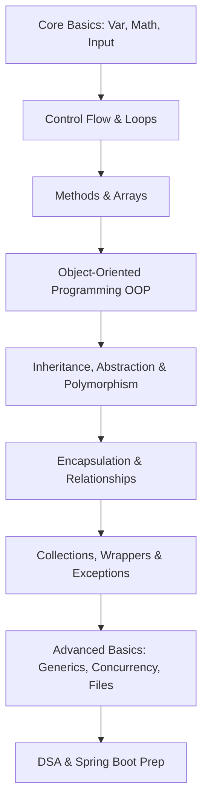

# ☕ Java Knowledge Base

<p align="center">
  
  
  
</p>

---

## 📌 Overview

Welcome to the **Java Knowledge Base**! This repository is a structured educational resource and reference vault documenting core Java programming concepts, from basic syntax up to multi-threaded concurrency, object-oriented design patterns, and interactive mini-projects.

It is structured to serve dual roles:
1. **IntelliJ Developer Workspace:** Highly organized under the unified root namespace `javakb`.
2. **Obsidian Knowledge Vault:** Direct integration with concept notes organized separately inside the `docs/` folder, linking directly to source codes.

---

## 🚀 Learning Roadmap



---

## 🎯 Progress Tracker

- [x] **Phase 1: Procedural Fundamentals** (Chapters 01 - 06)
- [x] **Phase 2: Object-Oriented Programming** (Chapters 07 - 11)
- [ ] **Phase 3: Core API & Ecosystem** (Chapters 12 - 16)
- [ ] **Phase 4: Advanced Java Mechanics** (Chapter 17 & Projects)

---

## 📂 Chapter Directory

All documentation is stored inside the `docs/` folder to keep the source tree clean. Use the links below to navigate between conceptual documentation and IntelliJ-runnable code.

| Chapter | Topic | Concept Notes | Code Folder | Status |
| :--- | :--- | :--- | :--- | :---: |
| **ch01** | Java Basics (Syntax, Printf, Input) | [Notes](docs/java/ch01_basics.md) | [Code](src/javakb/ch01_basics) | `[x]` |
| **ch02** | Control Flow (If-Else, Switch) | [Notes](docs/java/ch02_controlflow.md) | [Code](src/javakb/ch02_controlflow) | `[ ]` |
| **ch03** | Loops (While, For, Nested) | [Notes](docs/java/ch03_loops.md) | [Code](src/javakb/ch03_loops) | `[ ]` |
| **ch04** | Methods (Scope, Overloading, Varargs) | [Notes](docs/java/ch04_methods.md) | [Code](src/javakb/ch04_methods) | `[ ]` |
| **ch05** | Arrays (1D, 2D, Linear Search) | [Notes](docs/java/ch05_arrays.md) | [Code](src/javakb/ch05_arrays) | `[ ]` |
| **ch06** | Strings (Manipulation, Builders) | [Notes](docs/java/ch06_strings.md) | [Code](src/javakb/ch06_strings) | `[ ]` |
| **ch07** | Object-Oriented Basics (Classes, Statics) | [Notes](docs/java/ch07_oop.md) | [Code](src/javakb/ch07_oop) | `[ ]` |
| **ch08** | Inheritance (Subclassing, Super, Overrides)| [Notes](docs/java/ch08_inheritance.md) | [Code](src/javakb/ch08_inheritance) | `[ ]` |
| **ch09** | Abstraction (Interfaces, Polymorphism) | [Notes](docs/java/ch09_abstraction.md) | [Code](src/javakb/ch09_abstraction) | `[ ]` |
| **ch10** | Encapsulation (Accessors, Data Hiding) | [Notes](docs/java/ch10_encapsulation.md) | [Code](src/javakb/ch10_encapsulation) | `[ ]` |
| **ch11** | Object Relationships (Aggregation, Comp) | [Notes](docs/java/ch11_relationships.md) | [Code](src/javakb/ch11_relationships) | `[ ]` |
| **ch12** | Collections Framework (Lists, Maps) | [Notes](docs/java/ch12_collections.md) | [Code](src/javakb/ch12_collections) | `[ ]` |
| **ch13** | Exception Handling (Try-Catch, Custom) | [Notes](docs/java/ch13_exceptions.md) | [Code](src/javakb/ch13_exceptions) | `[ ]` |
| **ch14** | File Handling (Streams, Reader/Writer) | [Notes](docs/java/ch14_filehandling.md) | [Code](src/javakb/ch14_filehandling) | `[ ]` |
| **ch15** | Generics (Type safety, Bounds) | [Notes](docs/java/ch15_generics.md) | [Code](src/javakb/src/javakb/ch15_generics) | `[ ]` |
| **ch16** | Date & Time API (Modern Time APIs) | [Notes](docs/java/ch16_datetime.md) | [Code](src/javakb/ch16_datetime) | `[ ]` |
| **ch17** | Concurrency (Threads, Executors) | [Notes](docs/java/ch17_concurrency.md) | [Code](src/javakb/ch17_concurrency) | `[ ]` |

---

## 🏆 Projects Showcase

Hands-on console applications categorized by complexity:

| Level | Project | Description | Code Link | Specs Link |
| :--- | :--- | :--- | :--- | :--- |
| **Beginner** | **Compound Interest Calculator** | Computes compound interest based on standard principal and rate user inputs. | [Code](src/javakb/projects/beginner/CompInterest.java) | [Doc Notes](docs/java/projects/beginner.md) |
| **Intermediate** | **Console Vending Machine** | A detailed retail simulation including inventory state updates, payment validations, and change calculations. | [Code](src/javakb/projects/intermediate/VendingMachine.java) | [Doc Notes](docs/java/projects/intermediate.md) |
| **Advanced** | *Placeholder* | Future threaded file-storage projects | [Code](src/javakb/projects/advanced) | [Doc Notes](docs/java/projects/advanced.md) |

---

## 🛠️ IntelliJ Setup & Compilation

To run the examples in this repository using IntelliJ IDEA:

1. Import the root `java-knowledge-base` folder into IntelliJ.
2. Mark the `src` folder as the **Sources Root** (Right-click `src` $\rightarrow$ *Mark Directory As* $\rightarrow$ *Sources Root*).
3. If packages show errors, run a project build/reindex (*Build* $\rightarrow$ *Rebuild Project*).

### Manual Compilation from Command Line
Because the code uses the base namespace package `javakb`, compile and run from the root folder:

```bash
# Compile a chapter file
javac -d out -sourcepath src src/javakb/ch07_oop/ClassesAndObjects.java

# Run the compiled file
java -cp out javakb.ch07_oop.ClassesAndObjects
```

---

## 🔮 Future Roadmap & Expansion

This repository is built to scale into these domains:
* **DSA (`src/javakb/dsa/` / `docs/dsa/`):** Data Structures (Arrays, LinkedLists, Trees, Graphs) & Algorithmic paradigms.
* **Advanced Java (`src/javakb/advanced_java/`):** Advanced stream APIs, Lambdas, JVM profiling.
* **JDBC (`src/javakb/jdbc/`):** Database integration patterns.
* **Design Patterns (`src/javakb/design_patterns/`):** Behavioral, Creational, and Structural patterns.
* **Spring Boot (`src/javakb/spring_boot/` / `docs/spring_boot/`):** REST API creation and enterprise configurations (using Maven/Gradle submodules).

---

## 👨‍💻 Author

**Harshwardhan**
* GitHub: [@harshwardhan1507](https://github.com/harshwardhan1507)
* Focus: Core Java • Software Architecture • DSA
