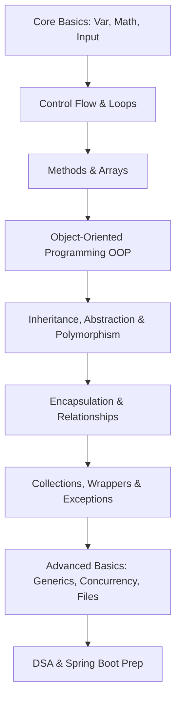

# ☕ Java Knowledge Base

<p align="center">
  
  
  
</p>

---

## 📌 Overview

Welcome to the **Java Knowledge Base**! This repository is a structured, production-grade learning index documenting core Java programming concepts, from basic syntax up to advanced thread concurrency, object-oriented design, and interactive mini-projects.

It is structured to serve as an **educational guide** and reference directory for beginners pursuing a strong coding foundation before moving into Data Structures & Algorithms (DSA) and enterprise web development (Spring Boot).

---

## 🚀 Live Learning Path



---

## 📂 Repository Directory Layout

All files are structured inside the standard Java package: `com.learning.java.*`.

```text
java-knowledge-base/
├── README.md
├── LICENSE
├── .gitignore
│
└── src/
    └── com/
        └── learning/
            └── java/
                ├── ch01_basics/       # Variables, User Input, Arithmetic, Printf
                ├── ch02_controlflow/  # If-Else, Switch, Logical Operators
                ├── ch03_loops/        # Loops (While, For, Nested, Break/Continue)
                ├── ch04_methods/      # Methods, Overloading, Scope, Varargs
                ├── ch05_arrays/       # 1D, 2D Arrays, User Input, Linear Search
                ├── ch06_strings/      # String manipulation, Substring routines
                ├── ch07_oop/          # Classes, Objects, Constructors, Statics
                ├── ch08_inheritance/  # Subclassing, Super, Overriding
                ├── ch09_abstraction/  # Abstract classes, Interfaces, Polymorphism
                ├── ch10_encapsulation/# Getters, Setters, Data hiding
                ├── ch11_relationships/# Aggregation and Composition
                ├── ch12_collections/  # ArrayList, HashMap, Wrapper classes
                ├── ch13_exceptions/   # Try-catch, throw, custom exceptions
                ├── ch14_filehandling/ # Read and Write file streams
                ├── ch15_generics/     # Generic classes and methods
                ├── ch16_enumsdates/   # Local Date Time APIs, Enum classes
                ├── ch17_concurrency/  # Multi-threading, Timers
                └── projects/
                    ├── beginner/      # Simple CLI calculators and utility tools
                    ├── intermediate/  # Complex CLI projects (e.g., Vending Machine)
                    └── advanced/      # Threaded, file-stored programs
```

---

## ⚙️ Getting Started & Run Instructions

### 📥 Prerequisites
* Install **JDK 17 or above**.
* Set up your `JAVA_HOME` environment variables.

### ▶️ Compiling & Running Packaged Java Code
Because this repository is organized using professional Java packages, compilation and execution require package-aware paths.

#### 1. Compile Code to an Output Folder
Navigate to the root directory of the repository (`java-knowledge-base/`) and use `-d` to specify the output target:
```bash
# Compile a specific class
javac -d out src/com/learning/java/ch07_oop/ClassesAndObjects.java

# Compile all source files
javac -d out src/com/learning/java/**/*.java
```

#### 2. Run with Classpath Root
Run the class using its fully qualified name from the directory containing the compiled `.class` files (`out`):
```bash
# Run using the -cp (classpath) argument
java -cp out com.learning.java.ch07_oop.ClassesAndObjects
```

---

## 🏆 Current Project Highlights

| Project Name | Path | Level | Description |
| :--- | :--- | :--- | :--- |
| **Compound Interest Calculator** | [CompInterest.java](file:///d:/Programming/oopspractise/src/com/learning/java/projects/beginner/CompInterest.java) | Beginner | Computes compound interest given principal, rate, times compounded, and term length. |
| **Car Demo (OOP Practice)** | [ClassesAndObjects.java](file:///d:/Programming/oopspractise/src/com/learning/java/ch07_oop/ClassesAndObjects.java) | Beginner | Introduction to basic encapsulation, class instantiation, instantiation states, and methods. |
| **Console Vending Machine** | [VendingMachine.java](file:///d:/Programming/oopspractise/src/com/learning/java/projects/intermediate/VendingMachine.java) | Intermediate | A complete transaction engine simulating products, cart accumulation, stock updates, and change payout. |

---

## 👨‍💻 Author

**Harshwardhan**
* GitHub: [@harshwardhan1507](https://github.com/harshwardhan1507)
* Focus: Core Java • Software Architecture • DSA

---

## ⭐ Support & Contributions

If you find this repository helpful, consider starring the repository ⭐ or submitting a pull request to add more concepts or practice exercises!