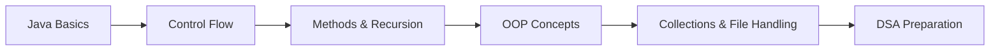

# ☕ Java Fundamentals & Practice

<p align="center">
  
  
  
</p>


---

## 📌 Overview

This repository is a **structured collection of Java programs** aimed at building a **strong foundation in core programming concepts**.

It emphasizes:
- Clean syntax understanding  
- Object-Oriented Programming (OOP)  
- Practical implementation of concepts  

📈 Designed as a **stepping stone before Data Structures & Algorithms (DSA)**.

---

## 🚀 Live Learning Path



---

## 📂 Topics Covered

### 🔹 Core Java
- Variables & Data Types  
- Operators & Expressions  

### 🔹 Control Flow
- `if / else`
- `switch`
- Loops (`for`, `while`, `do-while`)

### 🔹 Methods & Recursion
- Modular programming  
- Recursive logic building  

### 🔹 Object-Oriented Programming
- Classes & Objects  
- Inheritance  
- Polymorphism  
- Encapsulation  
- Abstraction  

### 🔹 Data Structures (Basic)
- Arrays  
- Strings  

### 🔹 Advanced Core
- Exception Handling  
- Collections (`ArrayList`, `HashMap`)  
- File I/O  

### 🔹 Practice Layer
- Mini programs for concept reinforcement  

---

## 🎯 Objective

✔ Build **strong programming fundamentals**  
✔ Master **Java syntax & OOP principles**  
✔ Prepare for **DSA & technical interviews**  
✔ Write **clean and maintainable code**  

---

## 🛠 Tech Stack

| Category | Tools |
|--------|------|
| Language | Java |
| JDK | 17+ |
| IDE | IntelliJ / VS Code / Eclipse |
| Version Control | Git & GitHub |

---

## ⚙️ Getting Started

### 📥 Prerequisites
- Install **JDK 17 or above**
- Set up environment variables (`JAVA_HOME`)

### ▶️ Run Locally

```bash
# Clone the repository
git clone https://github.com/harshwardhan1507/java-practice.git

# Navigate into the directory
cd java-practice

# Compile
javac FileName.java

# Run
java FileName
```

---

## 📊 Repository Stats

<p align="center">
  
</p>

<p align="center">
  
</p>

---

## 🔗 Related Work

| Repository | Description |
|------------|------------|
| [LeetCode Solutions](https://github.com/harshwardhan1507/leetcode) | DSA problems & coding interview prep in Java |

---

## 👨‍💻 Author

**Harshwardhan**  

- GitHub: https://github.com/harshwardhan1507  
- Focus: Java • DSA • Problem Solving  

---

## 🌱 Future Improvements

- Advanced Java concepts (Multithreading, Streams)  
- Structured problem sets  
- Performance optimization examples  
- Integration with DSA patterns  

---

## ⭐ Support

If you found this helpful:

- ⭐ Star the repository  
- 🍴 Fork it  
- 🛠 Contribute or suggest improvements  

---

## 📜 License

This project is open-source and available under the **MIT License**.

---

> “Strong fundamentals build strong engineers.”
